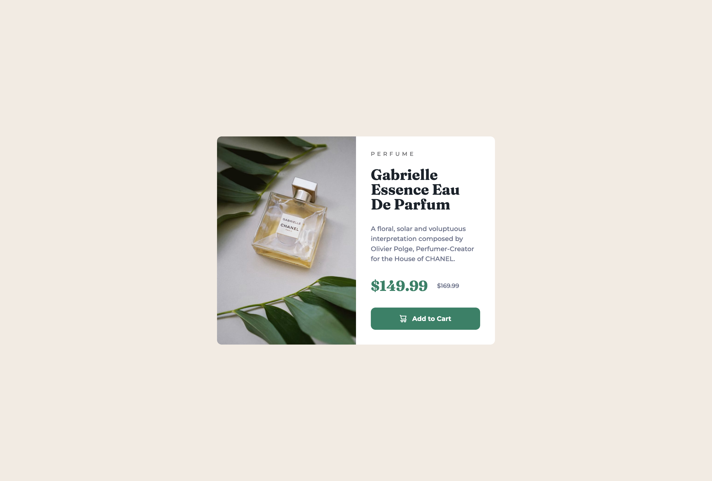

# Frontend Mentor - Product preview card component solution

This is a solution to the [Product preview card component challenge on Frontend Mentor](https://www.frontendmentor.io/challenges/product-preview-card-component-GO7UmttRfa). Frontend Mentor challenges help you improve your coding skills by building realistic projects. 

## Table of contents

- [Overview](#overview)
  - [The challenge](#the-challenge)
  - [Screenshot](#screenshot)
  - [Links](#links)
- [My process](#my-process)
  - [Built with](#built-with)
  - [What I learned](#what-i-learned)
  - [Useful resources](#useful-resources)
- [Author](#author)

**Note: Delete this note and update the table of contents based on what sections you keep.**

## Overview

### The challenge

Users should be able to:

- View the optimal layout depending on their device's screen size
- See hover and focus states for interactive elements

### Screenshot




### Links

- Solution URL: [https://github.com/hkparkjs/product-preview-card-component](https://github.com/hkparkjs/product-preview-card-component)
- Live Site URL: [https://myproduct-preview-card-component.netlify.app/](https://myproduct-preview-card-component.netlify.app/)

## My process

### Built with

- Semantic HTML5 markup
- Flexbox

### What I learned
 - How to apply media queries
```css
@media screen and (max-width: 678px) {
  (...)
}
```

 - How to apply different images according to resolution
```html
<picture>
  <source media="(max-width: 678px)" srcset="./images/image-product-mobile.jpg">
  
</picture>
```

### Useful resources

- [MDN Responsive Images](https://developer.mozilla.org/en-US/docs/Learn/HTML/Multimedia_and_embedding/Responsive_images) - This helped me for applying images by resolution.

## Author

- Frontend Mentor - [@hkparkjs](https://www.frontendmentor.io/profile/hkparkjs)